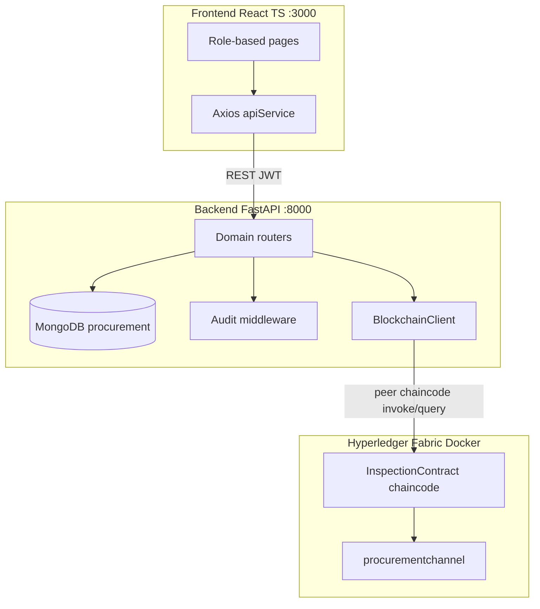
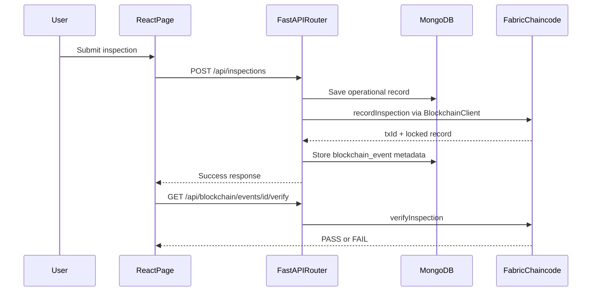
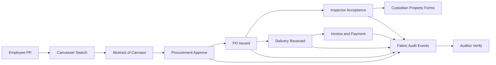

# Project Assessment Documentation

**Blockchain Procurement Management System (PAMS)**  
Informational assessment — how the system is built, what algorithms and patterns it uses, and why those choices were made.

This document complements [README.md](README.md) and [docs/PROJECT_STRUCTURE.md](docs/PROJECT_STRUCTURE.md). It is not a setup guide.

---

## Table of Contents

1. [Executive Summary](#1-executive-summary)
2. [System Architecture Assessment](#2-system-architecture-assessment)
3. [Technology Stack and Rationale](#3-technology-stack-and-rationale)
4. [Algorithms and Design Patterns](#4-algorithms-and-design-patterns)
5. [How the System Is Developed](#5-how-the-system-is-developed)
6. [End-to-End Example: Purchase Request to On-Chain Event](#6-end-to-end-example-purchase-request-to-on-chain-event)
7. [Project Assessment](#7-project-assessment)

---

## 1. Executive Summary

### What This System Is

The **Blockchain Procurement Management System** is a full-stack platform built for **Philippine government procurement workflows**. It covers the complete lifecycle of government purchasing:

- Purchase requests (PR) with multi-stage approval
- Canvassing, supplier management, and abstract of canvass
- Purchase orders (PO), deliveries, invoices, and payments
- Inspection and acceptance reports
- Property and inventory forms (ITR, PTR, custodian slips, waste materials reports, and related documents)

The frontend is branded as **PAMS** (Philippine Procurement Management System) in the React application.

### Core Design Principle

The system uses a **dual-persistence architecture**:

| Layer | Technology | Role |
|-------|------------|------|
| Operational data | MongoDB | Mutable workflow records, forms, user data |
| Audit ledger | Hyperledger Fabric | Immutable, tamper-evident procurement and inspection events |

MongoDB is the **primary database**. Hyperledger Fabric is an **optional audit ledger** — not the source of truth for day-to-day operations. When Fabric is unavailable, procurement data continues to save to MongoDB and the backend degrades gracefully.

### Maturity Snapshot

This is a **production-oriented full-stack application** with:

- ~20 role-specific frontend pages
- Domain-split FastAPI routers
- JWT role-based access control
- Off-chain audit logging in MongoDB
- On-chain event recording via Fabric chaincode
- Docker-based local Fabric network (2 orgs, 4 peers, CouchDB state DB)

The project does **not** implement a custom blockchain from scratch (no proof-of-work, mining, or Merkle tree logic in application code). Consensus, block formation, and cryptographic transport are delegated to Hyperledger Fabric.

---

## 2. System Architecture Assessment

### High-Level Architecture



### Repository Layout

```
BLOCKCHAIN/
├── backend/                    FastAPI API, MongoDB, auth, scraping
│   ├── main.py                 App entry, CORS, audit middleware
│   ├── routers/                Domain-split API routes
│   ├── api/blockchain_client.py Fabric CLI wrapper
│   ├── workflow_config.py      PR approval rules
│   └── blockchain/
│       ├── chaincode/          InspectionContract (Node.js)
│       └── network/            Docker Compose, channel config
├── frontend/                   React/TypeScript SPA
│   └── src/
│       ├── App.tsx             Routing and auth guards
│       ├── pages/              One page per workflow
│       ├── services/api.ts     Centralized Axios client
│       └── contexts/AuthContext.tsx
├── docs/                       Project notes
├── README.md                   Setup and API reference
└── documentation.md            This file
```

### Architectural Strengths

**Clean separation of concerns**

- The React frontend **never talks to Hyperledger Fabric directly**. All blockchain access goes through REST endpoints in `frontend/src/services/api.ts`, which proxy to the FastAPI backend.
- `backend/main.py` is a thin orchestrator: CORS, audit middleware, lifecycle hooks, and router registration. Business logic lives in `backend/routers/`.

**Dual persistence by design**

- MongoDB holds mutable workflow state (draft PRs, in-progress orders, user profiles).
- Fabric holds locked, write-once audit records (submitted PRs, issued POs, completed inspections).
- MongoDB documents store blockchain metadata (`blockchain_event_id`, `blockchain_event_tx_id`, etc.) after successful chain writes.

**Optional blockchain integration**

- Chain writes are wrapped in try/except. Failure returns a structured error but does not block MongoDB persistence.
- The backend starts and runs normally even when the Fabric Docker network is down.

**Role-driven access**

- Multiple user roles (employee, canvasser, procurement, inspector, custodian, finance, auditor, validator, admin) each see different navigation and pages.
- Route guards in `App.tsx` and conditional nav in `Layout.tsx` enforce access.

---

## 3. Technology Stack and Rationale

| Layer | Technology | Version / Notes | Why This Choice |
|-------|------------|-----------------|-----------------|
| Frontend language | TypeScript | 4.9 | Typed API contracts, safer refactoring |
| Frontend framework | React | 18.2 | Component-based SPA, large ecosystem |
| Frontend build | Create React App | react-scripts 5 | Zero-config dev server with API proxy |
| UI library | Bootstrap + React Bootstrap | 5.3 | Government-style forms, tables, modals |
| Routing | React Router DOM | 6.x | Declarative protected routes |
| HTTP client | Axios | 0.27 | Interceptors for JWT and 401 handling |
| Backend language | Python | 3.10+ | Fast development, strong async support |
| Backend framework | FastAPI | ≥0.115 | Async I/O, automatic OpenAPI docs |
| Database driver | Motor + PyMongo | async MongoDB | Non-blocking database access |
| Primary database | MongoDB | local or Atlas | Flexible document model for procurement forms |
| Validation | Pydantic | v2 | Request/response schema validation |
| Authentication | JWT (HS256) + bcrypt | python-jose | Stateless API auth, industry-standard password hashing |
| Web scraping | BeautifulSoup4 + requests | — | Supplier search from external sites |
| Blockchain platform | Hyperledger Fabric | 2.5 | Permissioned ledger with built-in consensus |
| Chaincode runtime | Node.js | fabric-contract-api | Smart contract for audit records |
| Fabric state DB | CouchDB | 3.2 | Rich queries via composite keys |
| Infrastructure | Docker Compose | — | Local Fabric network orchestration |

### What Fabric Provides (Not Built in Application Code)

| Concern | Provided By |
|---------|-------------|
| Consensus (Raft ordering) | Fabric orderer (`etcdraft` in `configtx.yaml`) |
| Block hashing and chaining | Fabric peer/orderer internals |
| Transaction endorsement | Fabric endorsement policies (`MAJORITY Endorsement`) |
| Identity (MSP) and TLS | Fabric crypto material and network config |
| World state persistence | CouchDB per peer organization |

The application code focuses on **what to record** and **how to verify immutability**, not on building consensus or cryptographic primitives.

---

## 4. Algorithms and Design Patterns

This section distinguishes **algorithms and patterns implemented in this project** from **capabilities provided by Fabric**.

### 4A. Blockchain Approach — Permissioned Audit Ledger

#### Choice

Use **Hyperledger Fabric** as a permissioned audit ledger instead of implementing a custom blockchain with proof-of-work, Merkle trees, or mining.

#### Rationale

Government procurement audit trails require **tamper evidence** and **multi-party endorsement**, not public mining or cryptocurrency mechanics. Fabric provides:

- Known participants (Org1, Org2) with MSP identities
- Raft-based ordering for transaction sequencing
- Endorsement from multiple peers before commit
- Immutable transaction history per key

Building a custom chain would duplicate these concerns without adding domain value.

#### Custom On-Chain Logic

All application-specific blockchain logic lives in `backend/blockchain/chaincode/inspection_contract/inspection.js` as the **InspectionContract** smart contract.

| Pattern | Implementation | Purpose |
|---------|----------------|---------|
| Write-once immutability | Records set `locked: true` on first write; duplicate writes throw an error | Prevent tampering after submission |
| Integrity verification | `verifyInspection` / `verifyProcurementEvent` return PASS if locked AND exactly one history entry | Auditors can confirm records were not modified |
| Composite key indexing | Keys like `procurementEvent~{id}`, `eventType~event`, `entity~event`, `po~inspection` | Enable CouchDB partial key queries |
| Audit trail via history | `getHistoryForKey()` returns txId, timestamp, and value per transaction | Full on-chain change log per record |
| Idempotency | Backend treats "already locked" chaincode errors as success | Safe retries without duplicate events |

**Verification algorithm** (same logic for inspections and procurement events):

```javascript
// backend/blockchain/chaincode/inspection_contract/inspection.js
async verifyInspection(ctx, inspectionId) {
    const inspection = await this.getInspection(ctx, inspectionId);
    const history = await this.getInspectionHistory(ctx, inspectionId);
    const isLocked = Boolean(inspection.locked || inspection.islocked);

    return {
        inspectionId: inspectionId,
        exists: true,
        locked: isLocked,
        txId: inspection.txId,
        timestamp: inspection.timestamp,
        historyCount: history.length,
        isImmutable: history.length === 1 && isLocked,
        verification: isLocked && history.length === 1 ? 'PASS' : 'FAIL'
    };
}
```

A record passes verification when:

1. It exists on the ledger.
2. It is marked as locked.
3. Its history contains exactly one write (no subsequent modifications).

This is simpler than Merkle proof verification but sufficient for audit use cases where the ledger itself is the trust anchor.

#### On-Chain Record Structures

**Procurement event record:**

```json
{
  "eventId": "PRSUB-PR-2024-001",
  "eventType": "PURCHASE_REQUEST_SUBMITTED",
  "entityId": "PR-2024-001",
  "actor": "juan.delacruz",
  "status": "Submitted",
  "payload": { },
  "timestamp": "2024-06-15T10:30:00.000Z",
  "txId": "abc123...",
  "creatorMspId": "Org1MSP",
  "locked": true
}
```

**Inspection record:**

```json
{
  "inspectionId": "INSP-PO-2024-005",
  "poNumber": "PO-2024-005",
  "inspectionDate": "2024-06-20",
  "inspectedBy": "maria.santos",
  "status": "Accepted",
  "items": [ ],
  "overallRemarks": "All items conforming",
  "timestamp": "2024-06-20T14:00:00.000Z",
  "txId": "def456...",
  "creatorMspId": "Org1MSP",
  "locked": true
}
```

#### Chaincode Functions

| Function | Type | Purpose |
|----------|------|---------|
| `recordProcurementEvent` | Invoke | Generic immutable procurement audit event |
| `recordPurchaseRequestSubmission` | Invoke | PR submitted |
| `recordPurchaseRequestApproval` | Invoke | PR approved |
| `recordPurchaseOrderIssuance` | Invoke | PO issued |
| `recordDeliveryReceiving` | Invoke | Delivery confirmed |
| `recordPaymentCompletion` | Invoke | Payment completed |
| `recordInspection` | Invoke | Lock inspection result |
| `getProcurementEvent`, `getAllProcurementEvents` | Query | Read events |
| `getInspection`, `getInspectionByPO` | Query | Read inspections |
| `getProcurementEventHistory`, `getInspectionHistory` | Query | Audit trail |
| `verifyProcurementEvent`, `verifyInspection` | Query | Integrity check |

#### Backend Fabric Client

`backend/api/blockchain_client.py` wraps Fabric peer CLI commands (`peer chaincode invoke` / `query`) via subprocess or Docker exec. It maps Python method calls to chaincode function names and handles TLS, MSP identity, and timeout configuration.

Key integration helpers in `backend/routers/deps.py`:

- `make_blockchain_event_id(prefix, entity_id)` — deterministic event IDs like `PRSUB-PR-2024-001`
- `record_procurement_event_on_chain(...)` — invoke chaincode with error handling
- `update_blockchain_event_metadata(...)` — store txId and timestamp back in MongoDB

---

### 4B. Workflow Approval — Threshold-Based State Machine

#### Choice

**Rule-based multi-stage approval** driven by PHP amount thresholds, implemented as a deterministic decision tree — not machine learning or dynamic routing.

#### Implementation

`backend/workflow_config.py` defines:

| Component | Description |
|-----------|-------------|
| `PRStatus` enum | Draft, Submitted, Under Review, Approved, Rejected, Cancelled |
| `ApprovalStage` enum | supervisor, manager, finance, done |
| `ApprovalMatrix` | Computes required stages from total amount |
| `WorkflowTransitions` | Role-gated permissions for create, submit, approve, reject, cancel |
| `APPROVAL_STAGE_ROLES` | Maps stages to approver roles |

#### Amount Thresholds (PHP)

| Amount Range | Required Approval Stages |
|--------------|--------------------------|
| Below ₱10,000 | Supervisor only |
| ₱10,000 – ₱49,999 | Supervisor + Manager |
| ₱50,000 – ₱99,999 | Supervisor + Manager + Finance |
| ₱100,000 and above | All stages (Supervisor + Manager + Finance) |

```python
# backend/workflow_config.py — simplified
@staticmethod
def get_required_stages(total_amount: float, ...) -> List[ApprovalStage]:
    stages = [ApprovalStage.SUPERVISOR]
    if total_amount >= ApprovalMatrix.LOW_AMOUNT_THRESHOLD:      # 10_000
        stages.append(ApprovalStage.MANAGER)
    if total_amount >= ApprovalMatrix.MEDIUM_AMOUNT_THRESHOLD:   # 50_000
        stages.append(ApprovalStage.FINANCE)
    return stages
```

#### Approver Role Mapping

| Stage | Roles That Can Approve |
|-------|------------------------|
| Supervisor | procurement, validator, admin |
| Manager | validator, admin |
| Finance | finance, admin |

This is a **finite state machine with role guards** — appropriate for government procurement compliance where rules are fixed and auditable, not learned from data.

---

### 4C. Security Algorithms (Application Layer)

| Algorithm | Location | Purpose |
|-----------|----------|---------|
| bcrypt (gensalt + hashpw) | `backend/auth.py` | Password hashing at registration |
| bcrypt (checkpw) | `backend/auth.py` | Password verification at login |
| JWT HS256 | `backend/auth.py` | Stateless access tokens (24-hour expiry) |
| Fabric MSP | Network crypto-config | On-chain participant identity |
| Fabric TLS | `blockchain_client.py` | Encrypted peer communication |

Password and token handling example:

```python
# backend/auth.py
ALGORITHM = "HS256"
ACCESS_TOKEN_EXPIRE_MINUTES = 60 * 24  # 24 hours

def get_password_hash(password: str) -> str:
    salt = bcrypt.gensalt()
    return bcrypt.hashpw(password.encode('utf-8'), salt).decode('utf-8')

def create_access_token(data: dict, ...):
    encoded_jwt = jwt.encode(to_encode, JWT_SECRET, algorithm=ALGORITHM)
    return encoded_jwt
```

No custom cryptographic implementations exist in application code beyond standard library usage.

---

### 4D. Supplier Search — Web Scraping and Domain Classification

#### Choice

Heuristic web scraping with domain-based source classification — not search ranking ML or NLP.

#### Implementation

`backend/Scraping/scraper.py`:

1. **HTTP fetch** — requests to external URLs
2. **HTML parsing** — BeautifulSoup extracts text, links, and structured data
3. **Domain classification** — allowlists categorize sources:

| Category | Example Domains | Supported as Supplier Source |
|----------|-----------------|------------------------------|
| Reference | wikipedia.org, data.gov.ph | No |
| Search/Map | google.com, duckduckgo.com | No |
| Marketplace | lazada.com.ph, shopee.ph, alibaba.com | Yes (with manual validation warning) |
| Supplier Website | Other domains | Yes |

4. **Regex extraction** — phone numbers, prices, and contact info parsed from page text

This supports canvassers during supplier discovery but requires human validation before official use in procurement documents.

---

### 4E. Off-Chain Audit Logging

#### Choice

Complement on-chain immutability with **mutable but searchable** audit logs in MongoDB.

#### Implementation

HTTP middleware in `backend/main.py` intercepts successful workflow status changes and writes to the `audit_logs` collection:

```python
@app.middleware("http")
async def audit_workflow_status_changes(request: Request, call_next):
    # After successful response (2xx), persist audit entry if set on request.state
    await db.audit_logs.insert_one({
        "username": ...,
        "action": ...,
        "entity": ...,
        "old_status": ...,
        "new_status": ...,
        "timestamp": datetime.utcnow()
    })
```

Routers set `request.state.workflow_status_change` when a status transition occurs. This provides fast querying for the Audit Logs admin page without requiring a Fabric query for every audit lookup.

**Dual audit strategy:**

| Store | Speed | Tamper Evidence | Use Case |
|-------|-------|-----------------|----------|
| MongoDB audit_logs | Fast | Moderate (admin access controlled) | Operational audit, admin dashboard |
| Fabric ledger | Slower | Strong (consensus-backed) | Compliance verification, external audit |

---

## 5. How the System Is Developed

This section describes the **observed development methodology and patterns** used across the codebase — useful as a reference for how new features should be added.

### Development Flow Example



### Backend Development Patterns

#### 1. Feature-First Router Split

Domain logic is organized by feature, not by HTTP method:

| Router | Responsibility |
|--------|----------------|
| `routers/auth.py` | Login, logout, current user |
| `routers/documents.py` | PRs, suppliers, orders, deliveries, invoices, payments |
| `routers/inspections.py` | Inspections and property/inventory forms |
| `routers/blockchain.py` | On-chain event queries and verification |
| `routers/admin.py` | Dashboard stats, audit logs, connections |
| `routers/users.py` | User management |
| `routers/deps.py` | Shared auth helpers, blockchain event utilities |

To add a new procurement document type: create Pydantic models in `models.py`, add routes in the appropriate router, and optionally hook chain recording in `deps.py`.

#### 2. Optional Blockchain Writes

Chain recording never blocks the primary workflow:

```python
# backend/routers/deps.py — pattern
async def record_procurement_event_on_chain(...) -> dict:
    try:
        return blockchain_client.record_procurement_event(...)
    except Exception as blockchain_error:
        return {
            "success": False,
            "error": str(blockchain_error),
            "message": "Blockchain recording failed",
        }
```

The calling router saves to MongoDB first, then attempts chain recording, then updates MongoDB with chain metadata regardless of success.

#### 3. Deterministic Event IDs

On-chain events use predictable IDs derived from entity identifiers:

```python
def make_blockchain_event_id(prefix: str, entity_id: str) -> str:
    safe_entity = "".join(ch if ch.isalnum() or ch in "-_" else "-" for ch in str(entity_id))
    return f"{prefix}-{safe_entity}"

# Examples: PRSUB-PR-2024-001, POISS-PO-2024-005, PAYDONE-INV-2024-012
```

This enables idempotent retries and easy correlation between MongoDB documents and ledger records.

#### 4. Workflow Configuration as Data

Approval rules live in `workflow_config.py` as enums, matrices, and transition tables — not embedded in route handlers. Changing thresholds or role mappings requires editing one module.

#### 5. Pydantic Models for API Contracts

Request and response shapes are defined in `backend/models.py`. FastAPI auto-generates OpenAPI docs at `/docs`.

### Frontend Development Patterns

#### 1. Centralized API Client

All HTTP calls go through `frontend/src/services/api.ts`:

- Axios instance with base URL (dev proxy to `:8000`, prod via `REACT_APP_API_URL`)
- Request interceptor adds `Authorization: Bearer <token>`
- Response interceptor clears token and redirects to `/login` on 401
- ~80 typed methods on the `apiService` object

The frontend has no Fabric SDK, web3, or direct chain access.

#### 2. Minimal Global State

Only authentication is global (`contexts/AuthContext.tsx`):

- `user`, `loading`, `login()`, `logout()`, `isAuthenticated`
- JWT stored in `localStorage` as `authToken`
- Session restored on mount via `GET /api/auth/me`

All page data uses local `useState` / `useEffect` — no Redux, Zustand, or React Query.

#### 3. Repeated Page Pattern

Most pages follow the same structure:

```
1. Local state: data[], loading, error, modals, toast
2. useEffect → fetch via apiService.*
3. validateForm() for inline validation
4. Bootstrap layout: Container → Card → Table → Modal
5. LoadingSpinner while loading; Toast on success/error
6. Role branching via useAuth().user?.role
```

Shared components: `LoadingSpinner`, `Toast`, `CardStat`, `Layout`, `AdminSidebar`.

#### 4. Role-Based Navigation

`Layout.tsx` conditionally renders nav links based on `user.role` and `user.is_admin`. Route guards in `App.tsx` use `ProtectedRoute` and `AdminRoute` wrappers.

| Role | Primary Features |
|------|------------------|
| employee | Create/view own purchase requests |
| canvasser | PR list, supplier search, abstract of canvass, PO |
| procurement | Item proposals, suppliers, blockchain explorer |
| inspector | Inspection and acceptance reports |
| custodian | ICS, PAR, ITR, PTR, property return, waste materials |
| finance | Purchase orders, blockchain financial records |
| auditor | Blockchain explorer, compliance reports |
| validator | Blockchain consensus view |
| admin | Full access: users, settings, audit logs, connections |

#### 5. Connection Telemetry

Authenticated clients send a heartbeat every 10 seconds via `apiService.connectionPing(clientId)`. The Connections admin page polls Fabric endpoint health every 5 seconds.

### Blockchain Network Development

Fabric network setup lives in `backend/blockchain/network/`:

| File | Purpose |
|------|---------|
| `docker-compose-fabric.yml` | Orderer, 2 orgs, 4 peers, CouchDB containers |
| `configtx.yaml` | Channel config, Raft consenter, endorsement policies |
| `crypto-config.yaml` | Certificate generation layout |
| `deploy-chaincode.ps1` | Chaincode packaging and deployment |
| `QUICK_START.md` | Step-by-step network setup |

Channel: `procurementchannel`  
Chaincode: `inspection` (InspectionContract)

### Legacy Artifacts

An older Flask-based demo UI exists in `frontend/dev_app.py` with mock block data (fake hash, nonce, previous_hash). This is **superseded** by the React SPA and Fabric-backed `frontend/src/pages/Blockchain.tsx`. The mock explorer is not connected to the live ledger.

---

## 6. End-to-End Example: Purchase Request to On-Chain Event

This walkthrough shows how algorithms and development patterns work together in a single workflow.

### Step 1: Employee Creates a Purchase Request

- **UI:** `frontend/src/pages/Orders.tsx` (or `/purchase-request` route)
- **API:** `POST /api/purchase-requests`
- **Backend:** `routers/documents.py` validates input, saves to MongoDB `purchase_requests` collection
- **Algorithm:** None yet — record is mutable (Draft status)

### Step 2: Approval Stages Computed

- **Trigger:** PR submission or amount update
- **Algorithm:** `ApprovalMatrix.get_required_stages(total_amount)` in `workflow_config.py`
- **Example:** PR total = ₱75,000 → requires Supervisor + Manager + Finance approval
- **Storage:** Required stages stored on the PR document in MongoDB

### Step 3: Multi-Stage Approval

- **UI:** Procurement/validator/finance users see PR in their queue
- **Algorithm:** `WorkflowTransitions` checks if user's role can approve at current stage
- **API:** `PUT /api/purchase-requests/{id}/approve` or `/reject`
- **Audit:** Middleware logs status change to MongoDB `audit_logs`
- **Status flow:** Draft → Submitted → Under Review → Approved (or Rejected)

### Step 4: On-Chain Event Recording

- **Trigger:** PR submission and/or final approval
- **Backend helper:** `record_procurement_event_on_chain()` in `deps.py`
- **Event ID:** `PRSUB-PR-2024-001` or `PRAPP-PR-2024-001`
- **Chaincode:** `recordPurchaseRequestSubmission` or `recordPurchaseRequestApproval`
- **Result:** Locked record on Fabric with txId and timestamp
- **MongoDB update:** PR document gets `blockchain_event_id`, `blockchain_event_tx_id`, `blockchain_event_recorded: true`

### Step 5: Downstream Events (PO, Delivery, Payment)

Same pattern repeats at each milestone:

| Workflow Step | Event Type | Event ID Prefix | Chaincode Function |
|---------------|------------|-----------------|-------------------|
| PO issued | PURCHASE_ORDER_ISSUED | POISS | recordPurchaseOrderIssuance |
| Delivery confirmed | DELIVERY_RECEIVING_CONFIRMED | DELREC | recordDeliveryReceiving |
| Payment completed | PAYMENT_COMPLETED | PAYDONE | recordPaymentCompletion |
| Inspection accepted | (inspection record) | INSP | recordInspection |

### Step 6: Auditor Verification

- **UI:** `frontend/src/pages/Blockchain.tsx`
- **API:** `GET /api/blockchain/events/{eventId}/verify`
- **Chaincode:** `verifyProcurementEvent` or `verifyInspection`
- **Algorithm:** PASS if record is locked and history count equals 1
- **Display:** Explorer shows event details, txId, timestamp, and verification status

### Complete Procurement Flow



---

## 7. Project Assessment

### Strengths

| Area | Assessment |
|------|------------|
| Domain modeling | Comprehensive coverage of Philippine government procurement forms and workflows |
| Blockchain usage | Practical and focused — audit-only, not over-engineered; Fabric handles consensus |
| Architecture | Clean separation: React → FastAPI → MongoDB + Fabric; UI never touches chain directly |
| Resilience | Graceful degradation when Fabric is offline; MongoDB remains operational |
| Access control | Role-based navigation and route guards across ~10 user roles |
| Audit strategy | Dual audit (MongoDB logs + Fabric ledger) balances speed and tamper evidence |
| Workflow rules | Configurable approval matrix in dedicated module, not scattered in routes |
| Developer experience | FastAPI auto-docs, TypeScript API client, CRA dev proxy |

### Gaps and Technical Debt

| Area | Description |
|------|-------------|
| Legacy Flask UI | Mock block explorer in `frontend/dev_app.py` with fake PoW fields — not connected to Fabric |
| Incomplete routes | Some report links in nav dropdown have no matching routes in `App.tsx` |
| Stale documentation | Frontend README references old `/chain`, `/mine` endpoints instead of `/api/blockchain/*` |
| Test coverage | Only `Dashboard.test.tsx` found; no backend or chaincode automated tests |
| Fabric integration | Subprocess/docker exec peer CLI — works locally but production would benefit from Fabric Gateway SDK |
| Debug logging | Heavy `console.log` in auth and routing code |
| No global error boundary | Frontend lacks React error boundary for unhandled exceptions |
| No data-fetch library | Pages use raw useEffect fetches; no caching, deduplication, or optimistic updates |

These are informational observations only — not action items unless prioritized.

### Algorithm and Design Philosophy

The project consistently follows these principles:

| Principle | Application |
|-----------|-------------|
| Platform-provided consensus | Fabric Raft ordering instead of custom mining or PoW |
| Rule-based workflow engines | Threshold approval matrix instead of ML for government compliance |
| Write-once + history verification | Simple immutability check instead of Merkle proofs in app code |
| Dual audit stores | MongoDB for operational speed, Fabric for tamper evidence |
| Optional blockchain | Chain writes are best-effort; MongoDB is always the source of truth |
| Deterministic identifiers | Predictable event IDs for idempotency and cross-reference |
| Heuristic over ML | Supplier scraping uses domain rules, not trained models |

### When to Extend vs. Replace

| Need | Recommended Approach |
|------|---------------------|
| New procurement form | Add Pydantic model + router endpoints + React page following existing page pattern |
| New on-chain event type | Add chaincode function + `record_procurement_event_on_chain` mapping + Blockchain UI filter |
| Change approval rules | Edit `workflow_config.py` thresholds and role mappings |
| Production Fabric deployment | Replace CLI wrapper with Fabric Gateway SDK; use connection profile |
| Better frontend data handling | Introduce React Query or SWR for caching — optional, not required |
| Remove legacy code | Delete or archive `frontend/dev_app.py`, templates, and forms.py |

---

## Related Documentation

| Document | Purpose |
|----------|---------|
| [README.md](README.md) | Setup, environment variables, API reference |
| [docs/PROJECT_STRUCTURE.md](docs/PROJECT_STRUCTURE.md) | Repository layout summary |
| [docs/BACKEND_ANALYSIS.md](docs/BACKEND_ANALYSIS.md) | Backend deep dive (partially predates router refactor) |
| [backend/blockchain/network/QUICK_START.md](backend/blockchain/network/QUICK_START.md) | Fabric network setup |
| [backend/README.md](backend/README.md) | Backend-specific setup and auth examples |
| [frontend/README.md](frontend/README.md) | Frontend features and scripts |

---

*This document is informational only. It describes the system as assessed at the time of writing and does not prescribe changes unless explicitly requested.*
